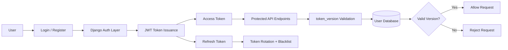

# Internship Tracker

A Django-based internship tracking application with user authentication, internship management, applications tracking, and a secure JWT-based API.

## Features

- User registration and login
- Custom user authentication with email-based login
- Internship dashboard and opportunity listing
- Application tracking for each internship
- User profile management
- REST API endpoints for internship and dashboard data
- JWT security with refresh token rotation and blacklist support
- Token version validation to invalidate stolen or replayed tokens

## Tech Stack

- Python
- Django
- Django REST Framework
- SimpleJWT
- SQLite database
- HTML/CSS/JavaScript frontend templates

## Architecture Overview



This flow shows the core security model: the user logs in, receives JWTs, and every protected API request is checked against the current `token_version` stored in the database.

## Project Structure

```text
internship_tracker/
├── api/
│   ├── authentication.py
│   ├── models.py
│   ├── serializers.py
│   ├── urls.py
│   ├── views.py
│   └── services/
├── home/
│   ├── models.py
│   ├── views.py
│   └── forms.py
├── templates/
├── static/
├── tracker/
│   ├── settings.py
│   ├── urls.py
│   └── wsgi.py
├── manage.py
├── db.sqlite3
├── requirements.txt (if added later)
├── README.md
└── documentation.txt
```

## Getting Started

### 1. Clone the repository

```bash
git clone <your-repository-url>
cd internship_tracker
```

### 2. Create and activate a virtual environment

On Windows:

```bash
python -m venv env
env\Scripts\activate
```

On macOS/Linux:

```bash
python3 -m venv env
source env/bin/activate
```

### 3. Install dependencies

```bash
pip install django djangorestframework djangorestframework-simplejwt pillow requests beautifulsoup4
```

### 4. Apply database migrations

```bash
python manage.py migrate
```

### 5. Run the development server

```bash
python manage.py runserver
```

Then open:

```text
http://127.0.0.1:8000/
```

## Main Routes

### Web views

- `/register/` - register a new user
- `/login/` - login page
- `/dashboard/` - main user dashboard
- `/home/` - internship opportunities page
- `/applications/` - user applications page
- `/profile/` - user profile page

### API routes

- `/api/v1/auth/login/`
- `/api/v1/token/`
- `/api/v1/token/refresh/`
- `/api/v1/auth/logout/`
- `/api/v1/internships/`
- `/api/v1/applications/`
- `/api/v1/profile/`
- `/api/v1/dashboard/`

## Authentication

The project uses Django REST Framework and SimpleJWT for authentication.

Key security features include:

- short-lived access tokens
- longer-lived refresh tokens
- refresh token rotation
- token blacklist after rotation
- custom `token_version` validation for session invalidation

This helps protect the app against unauthorized reuse of stale or stolen JWTs.

## Admin

You can create a superuser with:

```bash
python manage.py createsuperuser
```

Then access the admin panel at:

```text
http://127.0.0.1:8000/admin/
```

## Notes

This project is structured for internship tracking and secure API access, and it can be extended with:

- email notifications
- job filtering and sorting
- resume upload support
- analytics dashboard
- deployment configuration for production

## License

This project is for learning and portfolio use unless otherwise specified.
